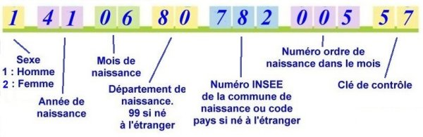

# NIR kata
> Write a system that can handle `NIR` (simplified rules explained below)

In this hands-on session we will develop together a system that can handle NIR "French social security number" by using / experimenting the following practices:
- `Test-Driven Development` to design a first version of our algorithm (with Example Based approach)
- `Fight Primitive Obsession` with `Parse Don't Validate` and `Monads`
- `Type-Driven Development` to "make impossible states unrepresentable"
- `Property-Based Testing` to drive our development
- `Mutation-Based Properties` to refine our code and identify edge cases

At the end of this code kata you will have understood a different way of designing code that may / will inspire you for your day-to-day life.

It will be a guided session, so no need to be an expert to join us.
Feel free to come and learn by mobing with us 👍

Code is available in `java` and `C#` (#sharingiscaring)
Original kata idea from Arnaud Bailly, thanks for that 😉.

## 1) Validate a NIR
- Design a system that can validate if a given `String` is a valid `NIR` number: `String -> Boolean`
- Use Test Driven Development to do so


## 2) Fight Primitive Obsession
- You must apply ["Parse Don't Validate"](https://xtrem-tdd.netlify.app/Flavours/parse-dont-validate) principle to fight ["Primitive Obsession"](https://xtrem-tdd.netlify.app/Flavours/no-primitive-types)
- Your `parsing function` must respect the below property
```text
for all (validNir)
parseNIR(nir.toString) == nir
```

in other words with `scalacheck`:

```scala
property("roundtrip") = forAll(validNIR) { nir =>
    parseNIR(nir.toString).value == nir
  }
```

With `parse don't validate` we want to make it impossible to represent an invalid `NIR` in our system:

- You can use `scala 3` [opaque types](https://docs.scala-lang.org/scala3/book/types-opaque-types.html)
- Use "Property-Based Testing" with `scalacheck` to drive your implementation

Your parser may look like this: `String -> Either[ParsingError, NIR]`

## How to
- Start with a `parser` that always returns `Right[NIR]`
  - Write a minimalist data structure first (empty one)
- Write a `positive property` test checking valid NIR can be round-tripped
  - Round-tripping: `NIR -> String -> NIR`
    - Assert that round-tripped `NIR` equals original `NIR` 
  - To do so, you will have to create your own valid NIR generator
- Write a `negative property` test checking `invalid NIRs` can not be parsed
  - This is where mutations are introduced
  - Each different mutation type representing some possible alteration of the `NIR`
  - Generate invalid NIRs by introducing mutations in the valid ones
- Use the properties to guide your implementation

Inspired by [Arnaud Bailly](https://abailly.github.io/about.html)

## NIR rules
`NIR` stands for "Numéro de sécurité sociale en France" it is a unique id representing an individual composed by 15 characters.

Here are the simplified specifications you will use for this kata:

| Positions  | Meaning                                                                                         | Possible values                     |
|------------|-------------------------------------------------------------------------------------------------|-------------------------------------|
| 1          | Sex : 1 for men, 2 for women                                                                    | 1 or 2                              |
| 2, 3       | Last two digits of the year of birth (which gives the year to the nearest century)              | From 00 to 99                       |
| 4, 5       | Birth month                                                                                     | From 01 (January) to 12 (December)  |
| 6, 7       | Department of birth                                                                             | From 01 to 95, 99 for births abroad |
| 8, 9, 10   | Official code of the city of birth                                                              | From 001 to 999                     |
| 11, 12, 13 | "Serial number": birth order number in the month and city                                       | From 001 to 999                     |
| 14, 15     | control key = complement to 97 of the number formed by the first 13 digits of the NIR modulo 97 | From 01 to 97                       |



### Examples
Here are some `valid NIRs` regarding those specifications:
- 223115935012322
- 200029923123486
- 254031088723464
- 195017262676215
- 155053933981739
- 106099955391094

And here are some `invalid` ones:
- 2230 // too short
- 323115935012322 // incorrect sex
- 2ab115935012322 // incorrect year
- 223ab5935012322 // incorrect month
- 223145935012322 // incorrect month 2
- 223005935012322 // incorrect month 3
- 22311xx35012322 // incorrect department
- 223119635012322 // incorrect department 2
- 2231159zzz12322 // incorrect city
- 223115935012321 // incorrect control key

## 3) Bulletproof your code with "Mutation-based Property-Driven Development"
Once implemented, you can challenge your system by introducing some mutants in your code.
We can create mutation on purpose thanks to our strong typing system (by introducing mutants in `valid NIRs`).

Some example of mutations:
- `Sex` mutant: a value greater than 2 for example
- `Truncate` mutant: truncate some characters in the nir string
- `Key` mutant: change the key by using a number between 1 and 97 that does not respect the key definition  


Read more about it [here](https://abailly.github.io/posts/mutation-testing.html)

## "Solutions"
Proposal of solutions are available in the `solution` directory:

- `C#` with `xUnit` | `LanguageExt` | `FsCheck`
- `java` with `jUnit` | `vavr` | `vavr-test`
- `scala 3` with `scalatest` | `scalacheck`
- `F#` with `xUnit` | `FsCheck`
- `kotlin` with `kotest`

A step-by-step guide in `java` is available [here](solution/docs/step-by-step.md)

## Resources
- [NIR full specification](https://fr.wikipedia.org/wiki/Num%C3%A9ro_de_s%C3%A9curit%C3%A9_sociale_en_France)
- [Online key calculator](http://nourtier.net/cle_NIR/cle_NIR.htm)

