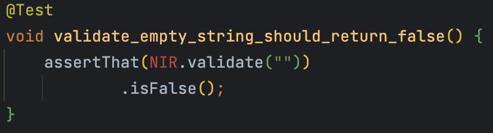
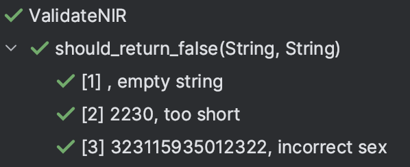
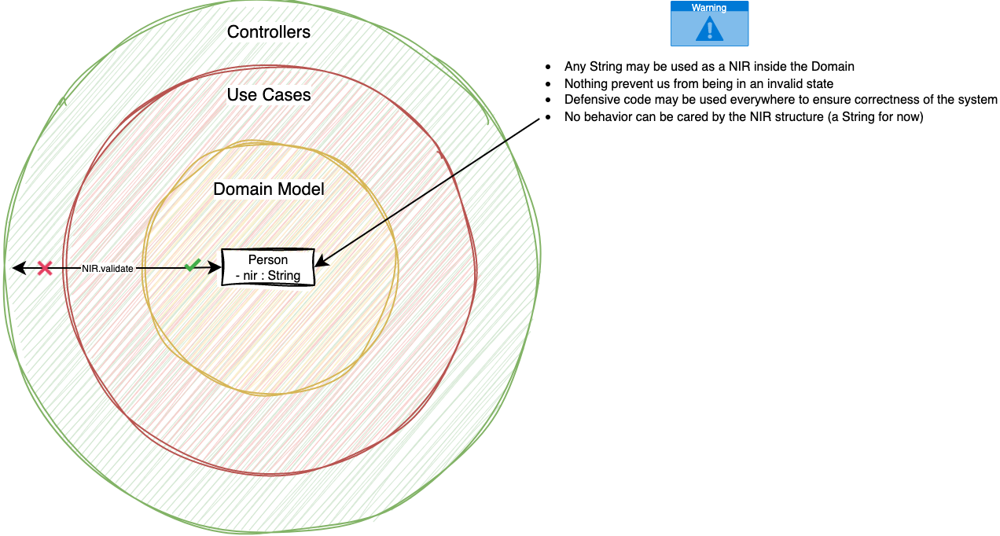

# NIR kata (Solution proposal)
This proposal is documented in `java` but the code is available in other languages (`C#`, `kotlin`, `scala`, `F#`).

## 1) Validate a NIR
Based on the specifications, we already have a test list to start with :

```text
Invalid NIRs
- 2230 // too short
- 323115935012322 // incorrect sex
- 2ab115935012322 // incorrect year
- 223ab5935012322 // incorrect month
- 223145935012322 // incorrect month 2
- 223005935012322 // incorrect month 3
- 22311xx35012322 // incorrect department
- 223119635012322 // incorrect department 2
- 2231159zzz12322 // incorrect city
- 223115935012321 // incorrect control key
- 2231159350123221 // too long

Valid NIRs
- 223115935012322
- 200029923123486
- 254031088723464
- 195017262676215
- 155053933981739
- 106099955391094
```

### Write our first test
:red_circle: Let's start by a failing test (as usual in T.D.D).
`What happens if the client code sends an empty String?`

```java
class ValidateNIR {
	@Test
	void validate_empty_string_should_return_false() {
		assertThat(NIR.validate(""))
				.isFalse();
	}
}
```

Our code is not compiling.


:green_circle: Make it `green` as fast as possible by [generating production code from usage](https://xtrem-tdd.netlify.app/Flavours/generate-code-from-usage).

```java
public class NIR {
    public static Boolean validate(String potentialNIR) {
        return false;
    }
}
```

:large_blue_circle: Refactor the code to introduce an empty `String` rule.
```java
public class NIR {
    public static Boolean validate(String potentialNIR) {
        return potentialNIR != "";
    }
}
```

### Too short String
:red_circle: Add a second test case for too short `String`.

```java
@Test
void validate_short_string_should_return_false() {
	assertThat(NIR.validate("2230"))
			.isFalse();
}
```

:green_circle: Add a `length` rule.
```java
public class NIR {
    public static Boolean validate(String potentialNIR) {
		return potentialNIR != "" && potentialNIR.length() == 15;
    }
}
```

:large_blue_circle: Simplify the expression and remove `magic number`.
```java
public class NIR {
    private static final int VALID_LENGTH = 15;

    public static Boolean validate(String potentialNIR) {
        return potentialNIR.length() == VALID_LENGTH;
    }
}
```

Our test list is now looking like this:
```text
Invalid NIRs
✅ empty string
✅ 2230 // too short
- 323115935012322 // incorrect sex
- 2ab115935012322 // incorrect year
- 223ab5935012322 // incorrect month
- 223145935012322 // incorrect month 2
- 223005935012322 // incorrect month 3
- 22311xx35012322 // incorrect department
- 223119635012322 // incorrect department 2
- 2231159zzz12322 // incorrect city
- 223115935012321 // incorrect control key
- 2231159350123221 // too long

Valid NIRs
- 223115935012322
- 200029923123486
- 254031088723464
- 195017262676215
- 155053933981739
- 106099955391094
```

### Incorrect Sex
:red_circle: Let's add a new expectation from our tests.
```java
@Test
void validate_with_invalid_sex_should_return_false() {
	assertThat(NIR.validate("323115935012322"))
			.isFalse();
}
```

:green_circle: Express sex validation.
```java
public static Boolean validate(String potentialNIR) {
	return potentialNIR.length() == VALID_LENGTH
			&& (potentialNIR.charAt(0) == '1' || potentialNIR.charAt(0) == '2');
}
```

:large_blue_circle: Extract named method for better comprehension.
```java
public class NIR {
    private static final int VALID_LENGTH = 15;

    public static Boolean validate(String potentialNIR) {
        return validateLength(potentialNIR)
                && validateSex(potentialNIR);
    }

    private static boolean validateLength(String potentialNIR) {
        return potentialNIR.length() == VALID_LENGTH;
    }

    private static boolean validateSex(String potentialNIR) {
        return potentialNIR.charAt(0) == '1' || potentialNIR.charAt(0) == '2';
    }
}
```

In refactoring stage, you should always wonder how to improve test code as well.
We have already some duplication in our tests. We could use parameterized tests instead of maintaining 1 test method per "test case".

With `junit`, we can create `Parameterized Tests` by using `junit-jupiter-params`.

```java
class ValidateNIR {
    public static Stream<Arguments> invalidNIRs() {
        return Stream.of(
                Arguments.of("", "empty string"),
                Arguments.of("2230", "too short"),
                Arguments.of("323115935012322", "incorrect sex")
        );
    }

    @ParameterizedTest
    @MethodSource("invalidNIRs")
    void should_return_false(String input, String reason) {
        assertThat(NIR.validate(input))
                .isFalse()
                .as(reason);
    }
}
```

Test output is now looking like this:


### Incorrect Year
:red_circle: Continue to add feature from our test list.

```java
public static Stream<Arguments> invalidNIRs() {
	return Stream.of(
		...
		Arguments.of("2ab115935012322", "incorrect year")
	);
}
```

> Be careful when using `Parameterized tests` to move 1 test case at a time.

:green_circle: Make it pass by hardcoding year validation. 

```java
public class NIR {
    private static final int VALID_LENGTH = 15;

    public static Boolean validate(String potentialNIR) {
        return validateLength(potentialNIR)
                && validateSex(potentialNIR)
                && validateYear(potentialNIR);
    }

    private static boolean validateLength(String potentialNIR) {
        return potentialNIR.length() == VALID_LENGTH;
    }

    private static boolean validateSex(String potentialNIR) {
        return potentialNIR.charAt(0) == '1' || potentialNIR.charAt(0) == '2';
    }

    private static boolean validateYear(String potentialNIR) {
        return false;
    }
}
```

:large_blue_circle: Implement year validation as expressed in specification.
I choose to use Regex to check whether `Year is a valid number or not`.
```java
private static boolean validateYear(String potentialNIR) {
	return potentialNIR
			.substring(1, 3)
			.matches("[0-9.]+");
}
```

The whole class can still be improved -> pass only the needed characters for inner validation.
```java
public class NIR {
	private static final int VALID_LENGTH = 15;
	private static final char MALE = '1', FEMALE = '2';

	public static Boolean validate(String potentialNIR) {
		return validateLength(potentialNIR)
				&& validateSex(potentialNIR.charAt(0))
				&& validateYear(potentialNIR.substring(1, 3));
	}

	private static boolean validateLength(String potentialNIR) {
		return potentialNIR.length() == VALID_LENGTH;
	}

	private static boolean validateSex(char sex) {
		return sex == MALE || sex == FEMALE;
	}

	private static boolean validateYear(String year) {
		return isANumber(year);
	}

	private static boolean isANumber(String potentialNumber) {
		return potentialNumber.matches("[0-9.]+");
	}
}
```

```text
Invalid NIRs
✅ empty string
✅ 2230 // too short
✅ 323115935012322 // incorrect sex
✅ 2ab115935012322 // incorrect year
- 223ab5935012322 // incorrect month
- 223145935012322 // incorrect month 2
- 223005935012322 // incorrect month 3
- 22311xx35012322 // incorrect department
- 223119635012322 // incorrect department 2
- 2231159zzz12322 // incorrect city
- 223115935012321 // incorrect control key
- 2231159350123221 // too long

Valid NIRs
- 223115935012322
- 200029923123486
- 254031088723464
- 195017262676215
- 155053933981739
- 106099955391094
```

### Fast Forward invalid NIRs
Here are the iterations (You can see their details from the git history):


Here is where we are in our test list:

```text
Invalid NIRs
✅ empty string
✅ 2230 // too short
✅ 323115935012322 // incorrect sex
✅ 2ab115935012322 // incorrect year
✅ 223ab5935012322 // incorrect month
✅ 223145935012322 // incorrect month 2
✅ 223005935012322 // incorrect month 3
✅ 22311xx35012322 // incorrect department
✅ 223119635012322 // incorrect department 2
✅ 2231159zzz12322 // incorrect city
✅ 223115935012321 // incorrect control key
✅ 2231159350123221 // too long

Valid NIRs
- 223115935012322
- 200029923123486
- 254031088723464
- 195017262676215
- 155053933981739
- 106099955391094
```

Some interesting stuff made during the implementation.
- Use `lombok` to define `Extension methods` on `String`
- Use `vavr` to use a more functional and less imperative way of coding

```java
@UtilityClass
public class StringExtensions {
    // Extension methods are static methods with at least 1 parameter
	// The first parameter type is the one we extend
    public static Option<Integer> toInt(String potentialNumber) {
        return isANumber(potentialNumber) // Use Option<Integer> -> equivalent to Optional since java 8
                ? some(Integer.parseInt(potentialNumber))
                : none();
    }

    private static boolean isANumber(String str) {
        return str != null && str.matches("[0-9.]+");
    }
}
```

- Use `String` extension methods from our production code

```java
@UtilityClass
// Reference extension classes
@ExtensionMethod(StringExtensions.class)
public class NIR {
	...

    private static boolean validateMonth(String month) {
        return validateNumber(month, x -> x > 0 && x <= 12);
    }

    private static boolean validateDepartment(String department) {
        return validateNumber(department, x -> x > 0 && (x <= 95 || x == 99));
    }

    // A generic method that parses a String then apply a validation function on it to check whether the value ensures it
	// Here is its signature: String -> (int -> bool) -> bool  
    private static boolean validateNumber(String potentialNumber, Function<Integer, Boolean> isValid) {
        return potentialNumber
                .toInt() // return an Option<Integer> (Some if something or None)
                .map(isValid) // called only if Some
                .getOrElse(false); // if none returns false
    }

    private static boolean isANumber(String potentialNumber) {
        return potentialNumber.matches("[0-9.]+");
    }
}
```

### Passing Test Cases
Because we have used `Triangulation` on invalid NIRs we already have created a general implementation.

`The more specific tests you write, the more the code will become generic.`

All our valid `NIRs` are already well validated, we do not have to modify anything in our production code.

```java
class ValidateNIR {
    public static Stream<Arguments> invalidNIRs() {
        return Stream.of(
                Arguments.of("", "empty string"),
                Arguments.of("2230", "too short"),
                Arguments.of("323115935012322", "incorrect sex"),
                Arguments.of("2ab115935012322", "incorrect year"),
                Arguments.of("223ab5935012322", "incorrect month"),
                Arguments.of("223145935012322", "incorrect month 2"),
                Arguments.of("223005935012322", "incorrect month 3"),
                Arguments.of("22311xx35012322", "incorrect department"),
                Arguments.of("223119635012322", "incorrect department 2"),
                Arguments.of("2231159zzz12322", "incorrect city"),
                Arguments.of("223115935012321", "incorrect key"),
                Arguments.of("2231159350123221", "too long")
        );
    }

    public static Stream<Arguments> validNIRs() {
        return Stream.of(
                Arguments.of("223115935012322"),
                Arguments.of("200029923123486"),
                Arguments.of("254031088723464"),
                Arguments.of("195017262676215"),
                Arguments.of("155053933981739"),
                Arguments.of("106099955391094")
        );
    }

    @ParameterizedTest
    @MethodSource("invalidNIRs")
    void should_return_false(String input, String reason) {
        assertThat(NIR.validate(input))
                .as(reason)
                .isFalse();
    }

    @ParameterizedTest
    @MethodSource("validNIRs")
    void should_return_true(String input) {
        assertThat(NIR.validate(input))
                .isTrue();
    }
}
```

Here is our final test list state from this stage.

```text
Invalid NIRs
✅ empty string
✅ 2230 // too short
✅ 323115935012322 // incorrect sex
✅ 2ab115935012322 // incorrect year
✅ 223ab5935012322 // incorrect month
✅ 223145935012322 // incorrect month 2
✅ 223005935012322 // incorrect month 3
✅ 22311xx35012322 // incorrect department
✅ 223119635012322 // incorrect department 2
✅ 2231159zzz12322 // incorrect city
✅ 223115935012321 // incorrect control key
✅ 2231159350123221 // too long

Valid NIRs
✅ 223115935012322
✅ 200029923123486
✅ 254031088723464
✅ 195017262676215
✅ 155053933981739
✅ 106099955391094
```

### Limit of this approach


Know more about `Primitive Obsession` [here](https://xtrem-tdd.netlify.app/Flavours/no-primitive-types)

## 2) Fight Primitive Obsession
Let's apply ["Parse Don't Validate"](https://xtrem-tdd.netlify.app/Flavours/parse-dont-validate) principle to fight ["Primitive Obsession"](https://xtrem-tdd.netlify.app/Flavours/no-primitive-types).
We will use [`Property Based Testing`](https://xtrem-tdd.netlify.app/Flavours/pbt) in this part of the kata to design our parser.

Our `parsing function` must respect the below property
```text
for all (validNir)
parseNIR(nir.toString) == nir
```

With `parse don't validate` we want to make it impossible to represent an invalid `NIR` in our system. Our data structures need to be `immutables`.

Our parser may look like this: `String -> Either<ParsingError, NIR>`

### Create the `Roundtrip` property
- Add `vavr-test` to do so

```kotlin
testImplementation("io.vavr:vavr-test:0.10.4")
```

:red_circle: Specify the property

```java
class NIRProperties {
    private Arbitrary<NIR> validNIR = null;

    @Test
    void roundTrip() {
        Property.def("parseNIR(nir.ToString()) == nir")
                .forAll(validNIR)
                .suchThat(nir -> NIR.parse(nir.toString()).contains(nir))
                .check()
                .assertIsSatisfied();
    }
}
```

:green_circle: Make it pass.
- Generate the `NIR` class
- Handle error with a data structure: `ParsingError`

```java
public record ParseError(String message) {
}

@EqualsAndHashCode
public class NIR {
    public static Either<ParsingError, NIR> parse(String input) {
        return right(new NIR());
    }

    @Override
    public String toString() {
        return "";
    }
}

class NIRProperties {
    private Arbitrary<NIR> validNIR = Arbitrary.of(new NIR());

    @Test
    void roundTrip() {
        Property.def("parseNIR(nir.ToString()) == nir") // describe the property
                .forAll(validNIR) // pass an Arbitrary / Generator to generate valid NIRs
                .suchThat(nir -> NIR.parse(nir.toString()).contains(nir)) // describe the Property predicate
                .check()
                .assertIsSatisfied();
    }
}
```

### Type-Driven Development
:large_blue_circle: Create the `Sex` type
  - We choose to use an `enum` for that
  - It is immutable by design
  - We need to work on the `String` representation of it
  - Each data structure will contain its own parsing method

```java
public enum Sex {
    M(1), F(2);

    private final int value;

    Sex(int value) {
        this.value = value;
    }

    public static Either<ParsingError, Sex> parseSex(char input) {
        // vavr Pattern matching
        return Match(input).of(
                Case($('1'), right(M)),
                Case($('2'), right(F)),
                Case($(), left((new ParsingError("Not a valid sex"))))
        );
    }

    @Override
    public String toString() {
        return "" + value;
    }
}
```

- Create a generator to be able to generate valid NIRs

```java
private final Gen<Sex> sexGenerator = Gen.choose(Sex.values());
```

- Extend `NIR` with the new created type

```java
@EqualsAndHashCode
public class NIR {
    private final Sex sex;

    public NIR(Sex sex) {
        this.sex = sex;
    }

    public static Either<ParsingError, NIR> parseNIR(String input) {
        return parseSex(input.charAt(0))
                .map(NIR::new);
    }

    @Override
    public String toString() {
        return sex.toString();
    }
}

class NIRProperties {
    private final Gen<Sex> sexGenerator = Gen.choose(Sex.values());
    private final Arbitrary<NIR> validNIR =
            sexGenerator.map(NIR::new)
                    .arbitrary();

    @Test
    void roundTrip() {
        Property.def("parseNIR(nir.ToString()) == nir")
                .forAll(validNIR)
                .suchThat(nir -> NIR.parseNIR(nir.toString()).contains(nir))
                .check()
                .assertIsSatisfied();
    }
}
```

### Design the Year type
Like for the `Sex` type, we design the new type with its generator.

:red_circle: create a generator

```java
private final Gen<Year> yearGenerator = Gen.choose(0, 99).map(Year::fromInt); // have a private constructor
private final Gen<Sex> sexGenerator = Gen.choose(Sex.values());
private final Arbitrary<NIR> validNIR =
        sexGenerator
                .map(NIR::new)
                // use the yearGenerator here
                .arbitrary();
```

:green_circle: To be able to use the `yearGenerator`, we need to have a context to be able to map into it.
It is a mutable data structure that we enrich with the result of each generator. We create a `Builder` class for it:

```java
@With
@Getter
@AllArgsConstructor
public class NIRBuilder {
    private final Sex sex;
    private Year year;

    public NIRBuilder(Sex sex) {
        this.sex = sex;
    }
}
```

- We now adapt the `NIRProperties` to use this `Builder`
```java
class NIRProperties {
    private final Random random = new Random();
    private final Gen<Year> yearGenerator = Gen.choose(0, 99).map(Year::fromInt);
    private final Gen<Sex> sexGenerator = Gen.choose(Sex.values());

    private Arbitrary<NIR> validNIR =
            sexGenerator
                    .map(NIRBuilder::new)
                    .map(builder -> builder.withYear(yearGenerator.apply(random)))
                    .map(x -> new NIR(x.getSex(), x.getYear()))
                    .arbitrary();

    @Test
    void roundTrip() {
        Property.def("parseNIR(nir.ToString()) == nir")
                .forAll(validNIR)
                .suchThat(nir -> NIR.parseNIR(nir.toString()).contains(nir))
                .check()
                .assertIsSatisfied();
    }
}
```

- We now have to adapt the `NIR` class to handle the `Year` in its construct
  - We will use the same `Builder` construct (in other languages we may use `for comprehension` or `LinQ` for example)

```java
@EqualsAndHashCode
@AllArgsConstructor
public class NIR {
    private final Sex sex;
    private final Year year;

    public static Either<ParsingError, NIR> parseNIR(String input) {
        return parseSex(input.charAt(0))
                .map(NIRBuilder::new)
                .flatMap(builder -> right(builder.withYear(new Year(1))))
                .map(builder -> new NIR(builder.getSex(), builder.getYear()));
    }

    @Override
    public String toString() {
        return sex.toString() + year;
    }
}
```

:large_blue_circle: We can now work on the `Year` type and its `parser`

```java
@EqualsAndHashCode
@AllArgsConstructor
public class NIR {
    private final Sex sex;
    private final Year year;

    public static Either<ParsingError, NIR> parseNIR(String input) {
        return parseSex(input.charAt(0))
                .map(NIRBuilder::new)
                .flatMap(builder -> parseYear(input.substring(1, 3), builder))
                .map(builder -> new NIR(builder.getSex(), builder.getYear()));
    }

    private static Either<ParsingError, NIRBuilder> parseYear(String input, NIRBuilder builder) {
        return Year.parseYear(input)
                .map(builder::withYear);
    }

    @Override
    public String toString() {
        return sex.toString() + year;
    }
}

@EqualsAndHashCode
@ExtensionMethod(StringExtensions.class)
public class Year {
    private final int value;

    public Year(int value) {
        this.value = value;
    }

    public static Either<ParsingError, Year> parseYear(String input) {
        return input.toInt()
                .map(Year::new)
                .toEither(new ParsingError("year should be between 0 and 99"));
    }

    public static Year fromInt(Integer x) {
        return parseYear(x.toString())
                .getOrElseThrow(() -> new IllegalArgumentException("Year"));
    }

    @Override
    public String toString() {
        return String.format("%02d", value);
    }
}
```

We can check `Properties` generation by printing the generated nirs:
```text
214
241
240
182
138
294
280
252
158
265
213
225
275
```

### Fast Forward the design of other types
